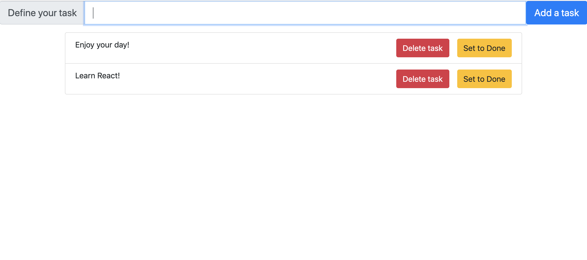

# ToDoList

- The user should have the ability to add a todo item through the input field
- The list of all todo items should be displayed for the user
- The user should be able to delete a todo item and to mark it as complete
- Here is an image for reference:
    
