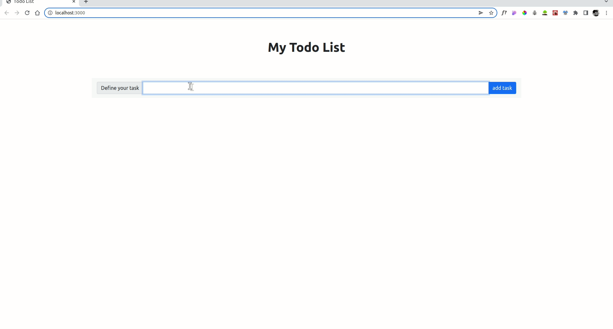

# Todo List
###### A Mini React app/ exercise to build a Todo List
## Demo
  
## What have i achieved:
- The user should have the ability to add a todo item through the input field
- The list of all todo items should be displayed for the user
- The user should be able to delete a todo item and to mark it as complete
### Modules/Packages/Libraries used:
```
- react: ^17.0.2
- react-bootstrap: ^2.2.2
- sass: ^1.49.7
    ```